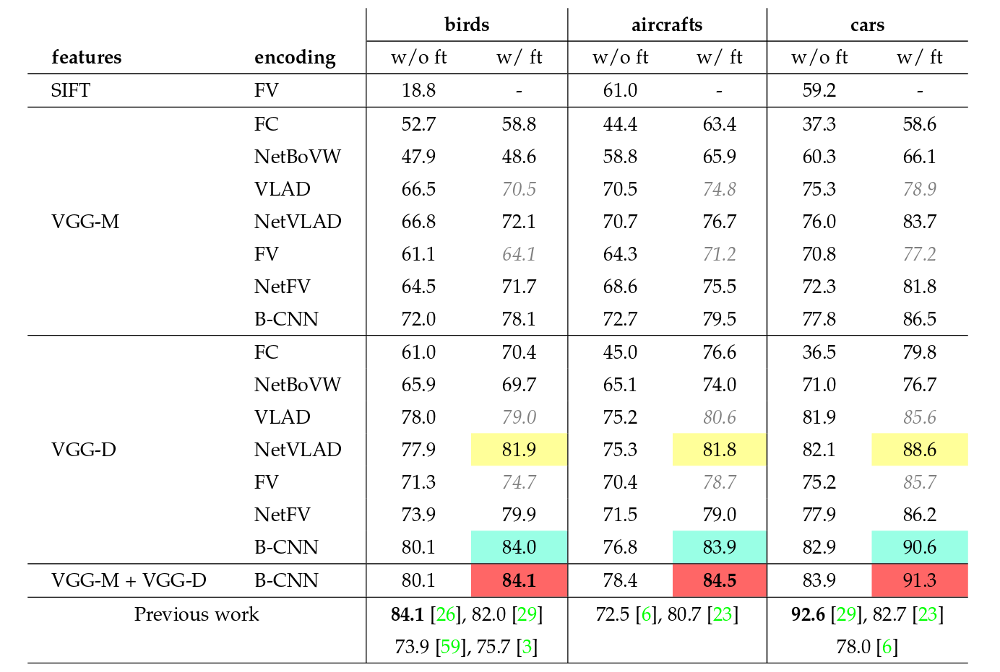
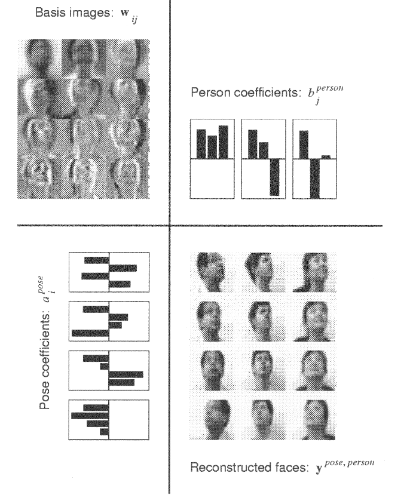

# Research Report On B-CNN & MatConvNet
---
    
    By Jincheng Su @ Hikvision, mail: jcsu14@fudan.edu.cn


[toc]

## 1. [Paper] Bilinear CNN Models for Fine-grained Visual Recognition

    Tsung-Yu lin et al, UMASS, ICCV15
	
<!--div style="text-align:center"></div-->

<!---->

 

#### 1.1 **Overview on Bilinear-CNN (B-CNN) Model**

B-CNN is an architecture which consists of two feature extractors whose outputs are multiplied using outer product at each location and then pooled to obtain image descriptors. The descriptors are in a translationally invariant manner which are particular useful for fine-grained categorization. After some normalizations, a linear classifier can be applied directly to these descriptors for classification.

The two feature extractors are usually truncated convolutional neural networks (CNNs) pretrained on **ImageNet** and then truncated at a convolutional layer including non-linearities. Outputs of the two truncated CNNs are then multiplied using outer product.  A sum-pooling step is then performed to obtain an image descriptor. The resulting bilinear descriptor is then reshaped as a vector and passed through a signed square-root step followed by a $l_2$ normalization step. Finally, a linear classifier is applied to perform the classification. 

By pre-training the model can benefit from additional training data when domain specific data is scarce. By using only the convolutional layers, another advantage is that the resulting CNN can process images of an arbitrary size in a single forward-propagationstep and produce outputs indexed by the location in the image and the feature model.

Using networks pretrained on the **ImageNet** dataset followed by `domain specific fine-tuning`, the model achieve 84.1% accuracy on the `CUB-200-2011` dataset requiring only category labels at training time, which is state-of-the-art (2015).


#### 1.2 **Bilinear Model**

A bilinear model $\mathcal{B}$ for image classification can be expressed by a quadruple:

$$ \mathcal{B} = (f_A, f_B, \mathcal{P}, \mathcal{C}).$$

Where
- $f_A, f_B$ are *feature extractor functions*: $f: \mathcal{L}\times\mathcal{I} \rightarrow \mathcal{R}^{c\times D}$, where
	- $\mathcal{I}$: be an input images,
	- $\mathcal{L}$: be a set of locations,
	- $\mathcal{R}$: be a set of features of size $c\times D$,

- $\mathcal{P}$ is a *pooling function*,
- $\mathcal{C}$ is a *classification function*.

The feature outputs are combined at each location using the matrix outer product, i.e., the *bilinear feature* combination of $f_A$ and $f_B$ at location $l$ is given by:

$$bilinear(l, \mathcal{I}, f_A, f_B) = f_A(l, \mathcal{I})^Tf_B(l, \mathcal{I}).$$

Where both $f_A(l, \mathcal{I})$ and $f_B(l, \mathcal{I})$ must have the same feature dimension $c$ to be compatible.

Followed by the outer product is the pooling function $\mathcal{P}$ that simply sum all the bilinear features over all locations $l\in\mathcal{L}$:

$$\mathcal{P}:~~\phi(\mathcal{I}) = \sum_{l\in \mathcal{L}}bilinear(l, \mathcal{I}, f_A, f_B).$$

If $f_A$ is with size $C\times M$, $f_B$ with $C\times N$, the $\phi(\mathcal{I})$ would have size $M \times N$.

Then $\phi(\mathcal{I})$ is reshape to a vector with size $MN\times 1$:

$$\phi(\mathcal{I}) = reshape(\phi(\mathcal{I}) , [MN, 1]).$$

In fact, given two feature maps outputed by CNN(s), what all above said can be implemented by first reshaping them to a vector, and then calculating their inner product. Given $n$ feature maps of size $m\times m$, firstly reshaping them to a $(m*m)\times n$-dimensional matrix denoted as $X_{(m*m)\times n}$, then calculating $X^TX$, and finally reshaping the result to a $n*n$-dimensional vector call bilinear vector $\phi(\mathcal{I})$, that is all what the `vl_nnbilinearpool or vl_nnbilinearclpool` function in `bcnn` source code about.

* **About matrix outer product**.
	The outer product usually refers to the tensor product of vectors. If you want something like the outer product between a $m \times n$ matrix $A$ and a $p\times q$ matrix $B$, you can see the generalization of outer product, which is the kronecker product. It is noted $A \otimes B$ and equals:
	$$A \otimes B = \begin{pmatrix}a_{11}B & \dots & a_{1n}B \\ \vdots & \ddots & \vdots \\ a_{m1}B & \dots & a_{mn}B\end{pmatrix}$$
As an example, the outer product of $A$ and $B$, where 
$$A = \begin{pmatrix}1 & 2 \\ 3 & 4\end{pmatrix} \qquad B = \begin{pmatrix}5 & 6 & 7 \\ 8 & 9 & 10\end{pmatrix}$$

	$$A\otimes B= \left( \begin{array}{cc} \left( \begin{array}{ccc} 5 & 6 & 7 \\ 8 & 9 & 10 \\ \end{array} \right) & \left( \begin{array}{ccc} 10 & 12 & 14 \\ 16 & 18 & 20 \\ \end{array} \right) \\ \left( \begin{array}{ccc} 15 & 18 & 21 \\ 24 & 27 & 30 \\ \end{array} \right) & \left( \begin{array}{ccc} 20 & 24 & 28 \\ 32 & 36 & 40 \\ \end{array} \right) \\ \end{array} \right) $$

#### 1.3 **Bilinear-CNN (B-CNN) model**

1. Use as feature extractors $f_A$ and $f_B$ two CNNs pretrained on the *ImageNet* dataset and truncated at a convolutional layer including non-linearities.

`imagenet-vgg-m.mat` truncated at layer 14 ($conv_5+relu$), referred as `M-Net`, and `imagenet-vgg-verydeep-16.mat` truncated at layer 30 ($conv_{5\_4} + relu$), referred as `D-Net`, are used in the paper.


2. Apply bilinear model presented above to get vector $x = \phi(\mathcal{I})$.

3. Passed through a signed square-root normalization followed by a $l_2$ normalization:

	$$y \leftarrow sign(x)\sqrt{|x|} $$
	$$z \leftarrow \frac{y}{||y||_2} $$

4. Use logistic regression or linear SVM as *classification function* $~~\mathcal{C}~$. $~$A linear SVM is used in this paper.

#### 1.4 **Implementation details**
1. `y = vl_nnbilinearclpool(x1, x2, varargin)`
	**Input**: two different features $x_1, x_2$ with size $[h_1, w_1, ch_1]$ and $[h_2, w_2, ch_2]$ for height, width and number of channels, and $\nabla_YZ$ (`dzdy`) which is the gradient of cost function $Z$ w.r.t $y$.
	**Output**: A bilinear vector $y$ with size $[ch1*ch2, 1]$.
	- **Feed forward.**
	  - Resize $x_1, x_2$ to the same size, i.e., downsampling one of them to ensure $ h_1 * w_1 == h_2 * w_2$:
			resize_image(x1, x2)
	  - Reshape $x_1, x_2$ to $X_a, X_b$ with sizes $[h_1 * w_1, ch_1]$ and $[h_2 * w_2, ch_2]$ respectively:
			Xa = reshape(x1, [h1*w1, ch1])
			Xb = reshape(x2, [h2*w2, ch2])
	  - Cacultate their outer product:
		$$ Y = X_a^T X_b$$
			  Y = Xa' * Xb
	  - Reshape $y$ to a vector with size $[ch_1 * ch_2, 1]$.
			y = reshape(Y, [ch1 * ch2, 1])

	- **Back propagation.**
	  Since $Y = X_a^TX_b$, calculate $\nabla_{X_a}Z$ is easy ($Z$ denote the cost function):
	$$
	  \begin{align}
	  & \nabla_{X_a}Z = \nabla_{X_a}Y\cdot\nabla_YZ = X_b\cdot(\nabla_YZ)^T,\\
	  & \nabla_{X_b}Z = \nabla_{X_b}Y\cdot\nabla_YZ = X_a\cdot(\nabla_YZ).\\
	  \end{align}
	$$
		- Reshape $x_1, x_2$ to $X_a, X_b$ with sizes $[h_1 * w_1, ch_1]$ and $[h_2 * w_2, ch_2]$ respectively:
				Xa = reshape(x1, [h1*w1, ch1])
				Xb = reshape(x2, [h2*w2, ch2])
		- Reshape input `dzdy` to size `[ch1, ch2]`.
				Delta = reshape(dzdy, [ch1, ch2]
		- Calculate `dzdxa` and `dzdxb`
				dzdxa = Xb * Delta'
				dzdxb = Xa * Delta
		- Reshape `dzdxa` and `dzdxb` to sizes as with `x1` and `x2`.
				dzdx1 = reshape(dzdxa, [h1, w1, ch1])
				dzdx2 = reshape(dzdxb, [h2, w2, ch2])

2. `y = vl_nnsqrt(x, param, varargin)`
	- **Feed forward** (element-wise operation):
		$$ y = sign(x)~ .* ~\sqrt{abs(x)}$$
		Note that $y$ is with the same size as $x$.

	- **Back propagation** (element-wise operation):
		$$ \frac{dy}{dx} = 0.5 ~.*~\frac{1}{\sqrt{abs(x) ~.+ ~param}}$$
		$$ \frac{dz}{dx} = \frac{dy}{dx}~.*~ \frac{dz}{dy}$$
		where $\frac{dy}{dx} = (\frac{dy_1}{dx_1}, ..., \frac{dy_n}{dx_n})^T$, and `param` is used for numeric stability.

3. `y = vl_nnl2normalization(x, param, varargin)`
	- **Feed forward**:
		$$ y= \frac{x}{||x||_2} $$
		Note that $y$ is with the same size as $x$.

	- **Back propagation**:
		$$
		\begin{align}
		\frac{d}{dx_j}(\frac{x}{||x||_2}) & = \frac{1}{||x||_2^3}(x_1^2 + ... + x_{j-1}^2 + x_{j+1}^2 + ... + x_n^2)\\
		& = \frac{1}{||x||_2} - \frac{x_j^2} {||x||_2^ 3}

		\end{align}
		$$
		Which gives the vectorize form:
		$$
		\nabla(\frac{x}{||x||_2}) = \frac{1}{||x||_2} ~.-~ \frac{x.^2} {||x||_2^ 3}
		$$
		where $x.^2 = (x_1^2, ..., x_n^2)^T$.

			To prevent large values and ensure numeric stability, it is recommended to preprocess ||x|| by adding a threshold:
		$$ ||x||_2 = ||x||_2 + threshold$$

#### 1.5 **Training Methodology**

Build a B-CNN model:

~~~mermaid
graph TD
	subgraph PretrainedCNNs
	A[truncated_CNNs]
	end
	style A fill: #6c4, stroke: #6d5;
	A-- \ -->B[vl_nnbilinearpool/vl_nnbilinearclpool]
	subgraph BilinearModel
	B-->C[sqrt&l2 normalization]
	end
	style B fill: #6c4, stroke: #6d5;
	style C fill: #6c4, stroke: #6d5;
	C-- \ -->D[conv_classifier]
	style D fill: #6c4, stroke: #6d5;
	subgraph LinearClassifer
	D-->E[softmaxloss]
	end
	style E fill: #6c4, stroke: #6d5;
~~~

Perform a two-step training:

* **Step 1**. Extract features using the `PretrainedCNNs+BilinearModel`, from the dataset. Train the `LinearClassifier` on the extracted features for the first step. It is a convex optimization problem. Using SGD algorithm with proper learning rate, the optima can be found quickly. For example, with $lr = 0.06$, it quickly reaches the optima in less than $10$ epochs.

* **Step 2**. Fine-tune the whole B-CNN model on the original dataset.  That is, initialize the `conv_classifier` with weights obtained from *step 1*.

After fine-tunning, remove `conv_classifier -> softmaxloss`, combine training and validation set, and train a set of one-vs-all linear SVMs on the features extracted from `l2_normalization` layer of the fine-tuned B-CNN model.

#### 1.6 **Experimental Results**

Feature fuctions in bilinear models can have no shared computations (e.g., B-CNN[D,M] model), share computations partially (e.g., NetVLAD, BCNN-PCA models), or share all computations (e.g., B-CNN[M,M] model) as shown in the following figure.

<!--div style="text-align:center"></div-->

Per-image accuracy on the **birds**, **aircrafts** and **cars** dataset for various methods. The first column lists the local features and the second column lists the encoding method. We consider SIFT, VGG-M network and VGG-D network for extracting local features.

For fully-connected (FC) models the features are extracted from the penultimate layer of the CNN, while for the texture representations the features are extracted from the `relu5` and `relu5_3` layer of VGG-M and VGG-D networks respectively.

Results are shown without and with domain-specific fine-tuning. For VLAD and FV encoding we also report results using indirect fine-tuning (in gray italics) where features are constructed from the corresponding layers of the fine-tuned FC-CNN models. Direct fine-tuning using approximate models works significantly better. The first, second, and third highest-performing methods are marked with red, blue and yellow colors respectively.


#### 1.7 **Intuitions On Bilinear Model**
Intuitively, the bilinear form allows the outputs of the feature extractors $f_A$ and $f_B$ to be conditioned on each other by considering all their pairwise interactions similar to a quadratic kernel expansion.

The two feature extractors might focus on different aspects of an object. By multiplication, it gives them the ability to modulate each other. For example, $f_A$ might focus on color detection while $f_B$ on feather detection. By taking multiplication, they are modulated with each other to be a, say, red feather.

But why is it multiplication rather than addition? For this question, I can only argue from the perspective of learning, i.e., training. Considering two neurons who takes two input $x_1, ~x_2 \in R$ and one outputs $a_1 = w_{11}x_1^2 + w_{12}x_1 x_2 + w_{21} x_2x_1 + w_{22}x_2^2$, while the other outputs $a_1 = w_1x_1 + w_2x_2$. Some of the gradients are $\frac{da_1}{dw_{11}} = x_1 x_2$,  $\frac{da_2}{dw_1} = x_1$, and $\frac{da_2}{dw_2} = x_2$ respectively. These gradients show that $w_2$ can not learn anything from the changes of $x_1$ and $w_1$ can not learn anything from the changes of $x_2$. In contrast, $w_{11}$ can learn from both the changes of $x_1$ and $x_2$, i.e., it can learn the interaction between $x_1$ and $x_2$. Put it another word, if we treat the $w$ terms as learning factors, then $w_{11}$ only learns from $x_1$, $w_{12}$ and $w_{21}$ learn from both $x_1$ and $x_2$, and $w_{22}$ only learns from $x_2$, while $w_1$ only learns $x_1$ and $w_2$ only learns $x_2$. 

For a symmetric B-CNN Model in this paper, it calculates firstly $Y = X^TX$ and then pass it throught a full-connected layer, which assigns each term $x_i^T x_j$ a different weight, where $x_i, x_j$  are vectors reshaped from two feature maps. It is the same procedure as the example given above.

Therefore, the bilinear form allows the network to learn the interactions between feather extractors.

## 2 **MatConvNet**

The B-CNN model is implemented based on [*MatConvNet*](http://www.vlfeat.org/matconvnet/).

**MatConvNet** is a MATLAB toolbox implementing *Convolutional Neural Networks* (CNNs) for computer vision applications. It is simple, efficient, and can run and learn state-of-the-art CNNs. Many pre-trained CNNs for image classification, segmentation, face recognition, and text detection are available.

* [**Main functions provided**](http://www.vlfeat.org/matconvnet/functions/):
        
        vl_nnbilinearsampler
        vl_nnconcat
        vl_nnspnorm
        vl_nnpdist
        vl_nnconv
        vl_nnconvt
        vl_nncrop
        vl_nndropout
        vl_nnloss
        vl_nnnoffset
        vl_nnnormalize
        vl_nnpool
        vl_nnrelu
        vl_nnroipool
        vl_nnsigmoid
        vl_nnsoftmax
        vl_nnsoftmaxloss
        DagNN wrapper
        vl_simplenn
        vl_simplenn_tidy
        vl_simplenn_diagnose
        vl_simplenn_display
        vl_simplenn_move
        vl_argparse
        vl_compilenn
        vl_rootnn
        vl_setupnn
        vl_imreadjpeg
        vl_taccum

* [**Pretrained models**](http://www.vlfeat.org/matconvnet/pretrained/):
    
    * **Fast R-CNN** for object detection
    * **VGG-Face** for face recognition
    * **Fully-Convolutional Networks** (FCN), **BVLC FCN** and **Torr Vision Group FCN-8s** for semantic segmentation
    * **ResNet**, **GoogLeNet**, **VGG-VD**, **VGG-S/M/F**, **Caffe reference model**, and **AlexNet** for ImageNet ILSVRC classification.

* **Documentation**

    * [manual](http://www.vlfeat.org/matconvnet/matconvnet-manual.pdf)
    * [Function description](http://www.vlfeat.org/matconvnet/functions/)
    * [CNN practical](http://www.robots.ox.ac.uk/~vgg/practicals/cnn/)

## 3. **Delving Into The Source Code**

#### 3.1 Having an overview.

`run_experiments_bcnn_train.m` under `/path/to/bcnn/` is a top-level function that performs the **two-step** training of a `B-CNN` model. Having a look into this function can give us a quick overview of the source code.

* Overview of `run_experiments_bcnn_train.m`:

	             Entry :`run_experiments_bcnn_train()`
	               |
	     Set Pretrained CNN(s): `bcnnmm`, `bcnnvdm`, or `bcnnvdvd` or all three
		           |
		Set Model Parameters and dataset: `[opts, imdb] = model_setup(/*parameter pairs*/)
	               |
		 Begin to train a bcnn model: `imdb_bcnn_train_dag(imdb, opts)`
	               |
				  End

    The first job of this function is to set the `B-CNN` model (`B-CNN[M,M]`, `B-CNN[D,D]`, or `B-CNN[M,D]`) and set the dataset via `bcnnxx.opts`, `setupNameList`, `encoderList` and `datasetList`: 

    ```matlab
    % run_experiments_bcnn_train.m

    bcnnmm.name = 'bcnnmm' ;
    bcnnmm.opts = {...
    'type', 'bcnn', ...
    'modela', 'data/models/imagenet-vgg-m.mat', ...     % intialize network A with pre-trained model
    'layera', 14,...                                    % specify the output of certain layer of network A to be bilinearly combined
    'modelb', 'data/models/imagenet-vgg-m.mat', ...     % intialize network B with pre-trained model
    'layerb', 14,...                                    % specify the output of certain layer of network B to be bilinearly combined
    'shareWeight', true,...                             % true: symmetric implementation where two networks are identical
    } ;

    bcnnvdm.name = 'bcnnvdm' ;
    bcnnvdm.opts = {...
    'type', 'bcnn', ...
    'modela', 'data/models/imagenet-vgg-verydeep-16.mat', ...
    'layera', 30,...
    'modelb', 'data/models/imagenet-vgg-m.mat', ...
    'layerb', 14,...
    'shareWeight', false,...                            % false: asymmetric implementation where two networks are distinct
    } ;

    bcnnvdvd.name = 'bcnnvdvd' ;
    bcnnvdvd.opts = {...
    'type', 'bcnn', ...
    'modela', 'data/models/imagenet-vgg-verydeep-16.mat', ...
    'layera', 30,...
    'modelb', 'data/models/imagenet-vgg-verydeep-16.mat', ...
    'layerb', 30,...
    'shareWeight', true,...
    };

    setupNameList = {'bcnnmm'};
    encoderList = {{bcnnmm}};
    % setupNameList = {'bcnnvdvd'};
    % encoderList = {{bcnnvdvd}};
    datasetList = {{'cub', 1}}
    ```

    Then it calls function `model_setup` to set up hyper-parameters and prepare dataset. Finally it calls function `imdb_bcnn_train_dag` to perform the *two-step* training.

* Overview of `model_setup(...)`:

				Entry:  `[opts, imdb] = model_setup(varargin)`
	              |
	    Setup data structure `opts`: `batchSize`, `numEpochs`, `learningRate`, ...
	              |
		Setup data structure `opts.encoders`: what the hell is encoders?
				  |
	        Load dataset: `cub`, `cars`, or `aircraft`, or others
	              |
	             End: save imdb

    Hyper-parameters of training is set default inside the `model_setup` function, and we can change it by passing a different value when it is called by `run_experiments_bcnn_train` or directly inside `model_setup`.

    Then it loads the dataset specified in `datasetList`:

    ```matlab
    % /path/to/bcnn/model_setup.m

        switch opts.dataset
            case 'cubcrop'
                imdb = cub_get_database(opts.cubDir, true, false);
            case 'cub'
                imdb = cub_get_database(opts.cubDir, false, opts.useVal);
            case 'aircraft-variant'
                imdb = aircraft_get_database(opts.aircraftDir, 'variant');
            case 'cars'
                imdb = cars_get_database(opts.carsDir, false, opts.useVal);
            case 'imagenet'
                imdb = cnn_imagenet_setup_data('dataDir', opts.ilsvrcDir);
            case 'imagenet-224'
                imdb = cnn_imagenet_setup_data('dataDir', opts.ilsvrcDir_224);
            otherwise
                error('Unknown dataset %s', opts.dataset) ;
        end
    ```

* Overview of `imdb_bcnn_train_dag(imdb, opts)`

	               Entry: `imdb_bcnn_train_dag(imdb, opts)`
                     |
          Setup some training params: `opts.train....`
                     |
        Build up and Initialize network: 
            `initializeNetworkSharedWeights` or ` initializeNetworkTwoStreams`
                     |
		Applying SGD algorithm to train the bcnn
                     |
                    End: save networks


The *two-step* training process is performed inside `imdb_bcnn_train_dag.m`. It calls `initializeNetworkSharedWeights` or `initializeNetworkTwoStreams` to perform training step 1 and `bcnn_train_simplenn` or `bcnn_train_dag` to perform traning step 2. Some hyper-parameters of step 1 are also set inside this function.

#### 3.2 Analysizing some typical functions in `bcnn-package` which implementes layers of a `B-CNN` model.

* `function y = vl_nnbilinearpool(x, varargin)`
    
    ```matlab
    % /path/to/bcnn/bcnn-package/vl_nnbilinearpool.m

    function y = vl_nnbilinearpool(x, varargin)
    % -----------------------------------------------------------------------------------
    % functionality:
    %   implementation of the feed forward pass and backward pass of 'bilinearpool', which
    %   is a layer connected next to a pretrained CNN model (or two same model)
    %
    % $x$: input feature of size [height, width, channels, batch size].
    % $varargin$: $dzdy$ when in backward pass.
    % $y$:
    %   forward pass:
    %       Self outer product of $x$.
    %       For each image with size `[height, width, channels]`, firstly
    %       reshape it into size `[height * width, channels]`, and then
    %       compute the output
    %                   $$y = \frac{1}{height * width} x^T x$$
    %       which gives $y$ the size `[channels, channels]`, reshape it again to a vector.
    %   backward pass:
    %       gradient of $y$ w.r.t $x$.
    %       $y$ is the same size as $x$, i.e., `[height, width, channels, batch_size]`.
    %       For each image, reshape $dzdy$ to size `[channels, channels]`
    %                       reshape $x$ to size `[height * width, channels]`.
    %       $dydx$ is caculated as:
    %                   $$y = \frac{1}{height * width} x * dzdy$$
    %       which gives $y$ the size `[height * width, channels]`,
    %       Reshape $y$ to `[height, width, channels]` as output.
    % -----------------------------------------------------------------------------------

    % if the number of elements in `varargin` > 0 and the first element is not a string
    backMode = numel(varargin) > 0 && ~isstr(varargin{1})

    % if in backward mode, take out the `dzdy` in `varargin`
    if backMode dzdy = varargin{1}; end

    % if `x` is a `gpuArray`, it is in `gpuMode`
    gpuMode = isa(x, 'gpuArray');

    % unpack the size of x into height, width, number of channel, and batch size
    [h, w, ch, bs] = size(x);

    % backward mode
    if backMode
        if gpuMode
            y = gpuArray(zeros(size(x), 'single'));
        else
            y = zeros(size(x), 'single'));
        end
        % for each image / for each feature map with `ch` channels
        for b = 1:bs
            dzdy_b = reshape(dzdy(1, 1, :, b), [ch, ch]);
            a = reshape (x(:, :, :, b), [h*w, ch]);
            % caculate dydx
            y(:, :, :, b) = reshape(a * dzdy_b, [h, w, ch]) / (h * w);
        end
    else
        if gpuMode
            y = gpuArray(zeros([1, 1, ch * ch, bs], 'single'));
        else
            y = zeros([1, 1, ch * ch, bs], 'single');
        for b = 1:bs
            a = reshape(x(:, :, :, b), [h * w, ch]);
            % caculate output
            y(1, 1, :, b) = reshape(a'*a, [1, ch*ch]) / (h * w);
        end
    end
    ```

* `function y = vl_nnbilinearclpool(x1, x2, varargin)`
    ```matlab
    % /path/to/bcnn/bcnn-package/vl_nnbilinearclpool.m

    function y = vl_nnbilinearclpool(x1, x2, varargin)
    % -----------------------------------------------------------------------------------
    % functionality:
    %   implementation of the feed forward pass and backward pass of 'bilinearclpool', which
    %   is a layer connected next to a pretrained CNN model (or two same model)
    %
    % $x$: input feature of size [height, width, channels, batch size].
    % $varargin$: $dzdy$ when in backward pass.
    % $y$:
    %   forward pass:
    %       Self outer product of $x$.
    %       For each image with size `[height, width, channels]`, firstly
    %       reshape it into size `[height * width, channels]`, and then
    %       compute the output
    %                   $$y = \frac{1}{height * width} x^T x$$
    %       which gives $y$ the size `[channels, channels]`, reshape it again to a vector.
    %   backward pass:
    %       gradient of $y$ w.r.t $x$.
    %       $y$ is the same size as $x$, i.e., `[height, width, channels, batch_size]`.
    %       For each image, reshape $dzdy$ to size `[channels, channels]`
    %                       reshape $x$ to size `[height * width, channels]`.
    %       $dydx$ is caculated as:
    %                   $$y = \frac{1}{height * width} x * dzdy$$
    %       which gives $y$ the size `[height * width, channels]`,
    %       Reshape $y$ to `[height, width, channels]` as output.
    % -----------------------------------------------------------------------------------

    % if the number of elements in `varargin` > 0 and the first element is not a string
    backMode = numel(varargin) > 0 && ~isstr(varargin{1})

    % if in backward mode, take out the `dzdy` in `varargin`
    if backMode dzdy = varargin{1}; end

    % if `x` is a `gpuArray`, it is in `gpuMode`
    gpuMode = isa(x1, 'gpuArray');

    % unpack the size of x into height, width, number of channel, and batch size
    [h1, w1, ch1, bs] = size(x1);
    [h2, w2, ch2, ~] = size(x2);

    % resize the CNN output to the same size
    if w1 * h1 <= w2 * h2
        % downsample feature 2
        x2 = array_resize(x2, w1, h1);
    else
        % downsample feature 1
        x1 = array_resize(x1, w2, h2);
    end
    h = size(x1, 1); w = size(x1, 2);

    % backward mode
    if backMode
        if gpuMode
            y = gpuArray(zeros(size(x), 'single'));
        else
            y = zeros(size(x), 'single'));
        end
        % for each image / for each feature map with `ch` channels
        for b = 1:bs
            dzdy_b = reshape(dzdy(1, 1, :, b), [ch1, ch2]);
            A = reshape (x1(:, :, :, b), [h*w, ch1]);
            B = reshape (x2(:, :, :, b), [h*w, ch2]);
            dB = reshape(A * dzdy_b, [h, w, ch2]);
            dA = reshape(B * dzdy_b', [h, w, ch1]); %'
            if w1 * h1 <= w2 * h2
                % B is downsampled
            else
                % A is downsampled
        end
    % feed forward pass
    else
        if gpuMode
            y = gpuArray(zeros([1, 1, ch1 * ch2, bs], 'single'));
        else
            y = zeros([1, 1, ch1 * ch2, bs], 'single');
        for b = 1:bs
            xa = reshape(x1(:, :, :, b), [h * w, ch1]);
            xb = reshape(x2(:, :, :, b), [h * w, ch2]);
            y(1, 1, :, b) = reshape(xa'*xb, [1, ch1*ch2]); % why not '/(h *w)'?
        end
    end

    function Ar = array_resize(A, w, h)
    %-----------------------------------------
    % downsample A with size `[w, h]`
    %-----------------------------------------

    ...

    ```

* `function y = vl_nnsqrt(x, param, varagin)`
    
    ```matlab
    % /path/to/bcnn/bcnn-package/vl_nnsqrt.m
    
    function y = vl_nnsqrt(x, param, varagin)
    % ---------------------------------------------------------------------
    % functionality: perform square root normalization for the input features
    %                at each location
    %
    % x: the input features of size [height, width, channels, batch_size]
    % param: the threshold to prevent large value when close to 0
    % varargin: dzdy, only needed in backward pass
    % y:
    %     forward pass:
    %         y = sign(x) .* sqrt(|x|)
    %     backward pass:
    %         dydx = 0.5 ./ sqrt(|x| + param)
    %         y = dydx .* dzdy % the chain rule
    % ---------------------------------------------------------------------
    ```

* `function y = vl_nnl2norm(x, param, varagin)`
    ```matlab
    % /path/to/bcnn/bcnn-package/vl_nnl2norm.m

    function y = vl_nnl2norm(x, param, varagin)
    % ---------------------------------------------------------------------
    % functionality: perform square root normalization for the input features
    %                at each location
    %
    % x: the input features of size [height, width, channels, batch_size]
    % param: the threshold to prevent large value when the norm is close to 0
    % varargin: dzdy, only needed in backward pass
    % y:
    %     forward pass:
    %         y = x ./ ||x||  % note: ||x|| is l-2 norm
    %     backward pass:
    %         \frac{d}{dx_j}(x./||x||) = \frack{1}{||x||^3}(x_1^2 + ... + x_{j-1}^2 + x_{j+1}^2 + ... + x_n^2)
    %         (d/dx_j)(x./||x||) = 1 / ||x|| - x_j^2 / ||x|| ^ 3
    %         gradient(x./||x||) = 1 / ||x|| - x.^2 / ||x|| ^ 3
    % ---------------------------------------------------------------------
    ```

#### 3.3 Looking into the code of preparing dataset.

To use the birds dataset `cub`, look into its function `imdb = cub_get_database(cubDir, useCropped, useVal)`:

```matlab
% cub_get_database.m

% the directory where the real images reside
if useCropped
	imdb.imageDir = fullfile(cubDir, 'images_cropped') ;
else
	imdb.imageDir = fullfile(cubDir, 'images');
end

...

% read the class names, image names, bounding boxes, lables...

[~, classNames] = textread(fullfile(cubDir, 'classes.txt'), '%d %s');
imdb.classes.name = horzcat(classNames(:));

% Image names
[~, imageNames] = textread(fullfile(cubDir, 'images.txt'), '%d %s');
imdb.images.name = imageNames;
imdb.images.id = (1:numel(imdb.images.name));

...

% if use validation, set 1/3 to validation set
if useVal
	rng(0)
	trainSize = numel(find(imageSet==1));

	trainIdx = find(imageSet==1);

	% set 1/3 of train set to validation
	valIdx = trainIdx(randperm(trainSize, round(trainSize/3)));
	imdb.images.set(valIdx) = 2;
end

...

```

Download the CUB-200-2011 dataset and unzip and find that all the required files are contained in the package, all we need to do is put the directory under `/path/to/bcnn_root/data` with a new name `cub`.

* Dataset details:
	* Birds: [CUB-200-2011 dataset](http://www.vision.caltech.edu/visipedia/CUB-200-2011.html). Birds + box uses bounding-boxes at training and test time.
	* Aircrafts: [FGVC aircraft dataset](http://www.robots.ox.ac.uk/~vgg/data/oid/)
	* Cars: [Stanford cars dataset](http://ai.stanford.edu/~jkrause/cars/car_dataset.html)
* These results are with domain specific fine-tuning. For more details see the updated [B-CNN tech report](http://arxiv.org/abs/1504.07889).

The job of `cub_get_database.m` is to build up a structure `imdb`:

    imdb =

        imageDir: 'data/cub/images'
         maskDir: 'data/cub/masks'
            sets: {'train'  'val'  'test'}
         classes: [1x1 struct]
          images: [1x1 struct]
            meta: [1x1 struct]

    imdb.images =

             name: {11788x1 cell}
               id: [1x11788 double]
            label: [1x11788 double]
           bounds: [4x11788 double]
              set: [1x11788 double]
        difficult: [1x11788 logical]

This structure seems quite clear. Only to note the member `imdb.images.set`, others are trivial.
```matlab
% /path/to/bcnn_root/cub_get_database.m
    ...
    imdb.images.set(imageSet == 1) = 1; % 1  for training
    imdb.images.set(imageSet == 0) = 3; % 3  for test

    if useVal
        ...
        % set 1/3 of train set to validation
        valIdx = trainIdx(randperm(trainSize, round(trainSize/3)));
        imdb.images.set(valIdx) = 2; % 2 for validation
    end
    ...
```
That `imdb.images.set` contains of a set of `set-lables`, one for each image. `1` lables the image for using in training, `2` for validation, and `3` for testing.

Let's trace the `imdb.iamges.set` to see how it is used in other files:
```bash
    $ grep imdb.images.set ./*.m
```

---
```matlab
    ./bcnn_train_dag.m:if isempty(opts.train), opts.train = find(imdb.images.set==1) ; end
    ./bcnn_train_dag.m:if isempty(opts.val), opts.val = find(imdb.images.set==2) ; end
    ./bcnn_train_simplenn.m:if isempty(opts.train), opts.train = find(imdb.images.set==1) ; end
    ./bcnn_train_simplenn.m:if isempty(opts.val), opts.val = find(imdb.images.set==2) ; end
    ./bird_demo.m:imageInd = find(imdb.images.label == classId & imdb.images.set == 1);
    ./imdb_bcnn_train_dag.m:train = find(imdb.images.set == 1) ;
    ./imdb_cnn_train.m:      train = find(imdb.images.set == 1) ;
    ./initializeNetworkSharedWeights.m:    train = find(imdb.images.set==1|imdb.images.set==2);
    ./initializeNetworkTwoStreams.m:        train = find(ismember(imdb.images.set, [1 2]));
    ./model_train.m:        train = find(ismember(imdb.images.set, [1 2])) ;
    ./model_train.m:    train = ismember(imdb.images.set, [1 2]) ;
    ./model_train.m:    test = ismember(imdb.images.set, 3) ;
    ./print_dataset_info.m:train = ismember(imdb.images.set, [1 2]) ;
    ./print_dataset_info.m:test = ismember(imdb.images.set, [3]) ;
    ./run_experiments_bcnn_train.m:          imdb.images.set(imdb.images.set==3) = 2;
```
The lines with `./bcnn_train_dag.m` and `./bcnn_train_simplenn.m` are doing the jobs of extracting images with label `1` as training set and images with `2` as validation set. But none of the lines are related to label `3`, i.e., the test set, except three lines:
```matlab
    ./model_train.m:    test = ismember(imdb.images.set, 3) ;
    ./print_dataset_info.m:train = ismember(imdb.images.set, [1 2]) ;
    ./print_dataset_info.m:test = ismember(imdb.images.set, [3]) ;
    ./run_experiments_bcnn_train.m:          imdb.images.set(imdb.images.set==3) = 2;
```
`model_train` is called by `run_experiments.m` and has no bussiness with `run_experiments_bcnn_train.m`. `print_dataset_info.m` prints out information about the dataset like:
```matlab
	>> print_dataset_info(imdb)
		dataset: classes: 200 in use. These are:
		   1: 001.Black_footed_Albatross (train:    60, test:     0 total:    60)
		   2: 002.Laysan_Albatross (train:    60, test:     0 total:    60)
		   3: 003.Sooty_Albatross (train:    58, test:     0 total:    58)
		   4: 004.Groove_billed_Ani (train:    60, test:     0 total:    60)
```

What left is the last line:

    ./run_experiments_bcnn_train.m:          imdb.images.set(imdb.images.set==3) = 2;

which sets the test set to validation set!

Therefore, in order to separate a test set, simply set `useVal` to `true` via params list in `model_setup` is not enough. It is also required to comment this line for leaving out a test set.

#### 3.4 Inspecting the code of building up a B-CNN model.
The code of building up the actual `B-CNN` model lies in file `initializeNetworkSharedWeights.m` or `initializeNetworkTwoStreams.m`. Have a look into `initializeNetworkSharedWeights.m`:

```matlab
% /path/to/bcnn/initializeNetworkSharedWeights.m

% ...

% Load the model
net = load(encoderOpts.modela);
net.meta.normalization.keepAspect = opts.keepAspect;

% truncate the network
maxLayer = max(encoderOpts.layera, encoderOpts.layerb);
net.layers = net.layers(1:maxLayer);

% ...

% stack bilinearpool layer
if(encoderOpts.layera==encoderOpts.layerb)
    net.layers{end+1} = struct('type', 'bilinearpool', 'name', 'blp');
else
    net.layers{end+1} = struct('type', 'bilinearclpool', 'layer1', encoderOpts.layera, 'layer2', encoderOpts.layerb, 'name', 'blcp');
end

% stack normalization
net.layers{end+1} = struct('type', 'sqrt', 'name', 'sqrt_norm');
net.layers{end+1} = struct('type', 'l2norm', 'name', 'l2_norm');

 net.layers{end+1} = struct('type', 'relu', 'name', 'relu_wbcnn');

% build a linear classifier netc
initialW = 0.001/scal * randn(1,1,mapSize1*mapSize2,numClass,'single');
initialBias = init_bias.*ones(1, numClass, 'single');
netc.layers = {};
netc.layers{end+1} = struct('type', 'conv', 'name', 'classifier', ...
    'weights', {{initialW, initialBias}}, ...
    'stride', 1, ...
    'pad', 0, ...
    'learningRate', [1000 1000], ...
    'weightDecay', [0 0]) ;
netc.layers{end+1} = struct('type', 'softmaxloss', 'name', 'loss') ;
netc = vl_simplenn_tidy(netc) ;

% ...

```
In this code block, the pretrained CNN is loaded from path `encoderOpts.modela` and truncated at layer `encoderOpts.layera`. Then a `bilinearpool` layer followed by a `sqrt` normalization and `l2norm` normalization layers are stacked upon the truncated CNN building up a `B-CNN` extractor `net`. 

A linear classifier `netc` is also created for classification. The classifier consists in a full-connected layer of size `[mapSize1*mapSize2, numClass]` followed by a `softmaxloss` layer.

The training step 1 is to train this classifier `netc`. Once the training completes, `netc` will be stacked upon `net` building up a complete B-CNN model available for traning step 2. 

#### 3.5 Analysizing the code of training step 1.

The traning step 1 is performed by `initializeNetworkSharedWeights.m`.
```matlab
% initializeNetworkSharedWeights.m

    ...

    % get bcnn feature for train and val sets
    train = find(imdb.images.set==1|imdb.images.set==2);

        ...

        % compute and cache the bilinear cnn features
        for t=1:batchSize:numel(train)

            ...

            batch = train(t:min(numel(train), t+batchSize-1));
            [im, labels] = getBatchFn(imdb, batch) ;

            netInit = net;

            ...

            net.layers{end}.class = labels ;

            res = [] ;
            res = vl_bilinearnn(netInit, im, [], res, ...
                'accumulate', false, ...
                'mode', 'test', ...
                'conserveMemory', true, ...
                'sync', true, ...
                'cudnn', opts.cudnn) ;
            codeb = squeeze(gather(res(end).x));
            for i=1:numel(batch)
                code = codeb(:,i);
                savefast(fullfile(opts.nonftbcnnDir, ['bcnn_nonft_', num2str(batch(i), '%05d')]), 'code');
            end
        end
    end

   ...

        bcnndb = imdb;
        tempStr = sprintf('%05d\t', train);
        tempStr = textscan(tempStr, '%s', 'delimiter', '\t');
        bcnndb.images.name = strcat('bcnn_nonft_', tempStr{1}');
        bcnndb.images.id = bcnndb.images.id(train);
        bcnndb.images.label = bcnndb.images.label(train);
        bcnndb.images.set = bcnndb.images.set(train);
        bcnndb.imageDir = opts.nonftbcnnDir;

        %train logistic regression
        [netc, info] = cnn_train(netc, bcnndb, @getBatch_bcnn_fromdisk, opts.inittrain, ...
            'conserveMemory', true);

    end

   ...

```
For each image in training and validation set, this code block extracts a bilinear feature from it using network `net`. Given a batch of images, the `vl_bilinearnn` here computes a bilinear feature for each of the images repectively.

The dataset `bcnndb` used for training network `netc` is then built up from these bilinear features. The training is performed by function `cnn_train`.


#### 3.6 The code of training step 2.

Training step 2 is performed by `bcnn_train_simplenn` or `bcnn_train_dag` as indicated by the following code block:
```matlab
% /path/to/bcnn/imdb_bcnn_train_dag.m

...

if simplenn
    fn_train = getBatchSimpleNNWrapper(train_bopts) ;
    fn_val = getBatchSimpleNNWrapper(val_bopts) ;
    [net,info] = bcnn_train_simplenn(net, imdb, fn_train, fn_val, opts.train, 'conserveMemory', true) ;
    net = net_deploy(net) ;
    saveNetwork(fullfile(opts.expDir, 'fine-tuned-model', 'final-model.mat'), net, info);
else
    fn_train = getBatchDagNNWrapper(train_bopts, useGpu) ;
    fn_val = getBatchDagNNWrapper(val_bopts, useGpu) ;
    opts.train = rmfield(opts.train, {'sync', 'cudnn'}) ;
    [net, info] = bcnn_train_dag(net, imdb, fn_train, fn_val, opts.train) ;
    net = net_deploy(net) ;
    save(fullfile(opts.expDir, 'fine-tuned-model', 'final-model.mat'), 'net', 'info', '-v7.3');
end

...

```

The function `bcnn_train_simplenn` is modified from `cnn_train` of **MatConvNet**, which implementes the SGD algorithm for training a simple network.

The function `bcnn_train_dag` is modified from `cnn_train_dag` of **MatConvNet**, which implementes the SGD algorithm for training a complex network.

#### 3.7 Additional training step.

Once training step 2 is done, the fine-tuning is said to be done. However, there should be one additional training step to train the whole network combining the training and validation dataset.
In this step, authors of the paper chop off the softmax classifier, i.e., `netc` in `initializeNetworkSharedWeights`, and replace it with a set of linear SVMs. After this additional training step, the test set had been left out is used for evaluating the accuracy of the final model.

Note that training SVMs in this additional step consumes more than 32GB main memory of CPU.

#### 3.8 Miscellaneous

* `vl_bilinearnn` is modified from `vl_simplenn` of **MatConvNet** and implementes both the forward pass and backward pass of a network.

* `imdb_get_batch` is used for fetching a batch of examples along with labels from dataset `*.imdb`. The output batch is ready to be passed to `vl_bilinearnn` for training or validation.

* `run_experiments` is used for training SVMs after training step 2.

## 4. [Paper] Separating Style and Content with Bilinear Models

    Joshua B. Tenenbaum et al, Neural Computation 2000

The paper describe a unified approach to fit models that discover explicit parameterized representations of what the training data of each row have in common independent of column, what the training data of each column have in common independent of row, and what all data have in common independent of both row and column -- the interaction of row and column factors.

The two terms *style* and *content* are generically referred to any two independent factors underlying a set of perceptual observations. For tasks that require generalization to novel classes of only one factor, the vaiable factor is referred as style and the invariant factor as content.

#### 4.1 Bilinear Models

###### Notation

Style: $a^s\in R^I$,

Content: $b^c\in R^J$,

Observation: $y^{sc}\in R^K$.

###### Symmetric Model

$$y_k^{sc} = \sum_{i=1}^I\sum_{j=1}^J w_{ijk}a_i^sb_j^c$$

The $w_{ijk}$ terms are independent of style and content and characterize the interaction of these two factors.

Letting $W_k$ denoete the $I\times J$ matrix with entries ${w_{ijk}}$,

$$y_k^{sc} = (a^s)^TW_kb^c,$$

Which gives the first interpretation that **the $K$ matrices $W_k$ describe a bilinear map from the style and content vector spaces to he $K$-dimensional observation space.**

Letting $w_{ij}$ denote the $K$-dimensional vector with components ${w_{ijk}}$,

$$y^{sc} = \sum_{i,j}w_{ij}a_i^sb_j^c,$$

which brings up the second interpretation that **the $w_{ij}$ terms represent $I\times J$ basis vectors of dimension $K$ and the observation $y^{sc}$ is generated by mixing these basis vectors with coefficients given by the tensor product of $a^s$ and $b^c$.**

As a conceret example, the $w_{ij}$ terms can be analogy to the eigenfaces. while the vector $a^s$ can be analogy to a pose and $b^c$ a person.

To render a an image of a particular person in a particular pose, a set of $I\times J$ basis images $w_{ij}$ is linearly mixed with coefficients given by the tensor product of the two parameter vectors $a^s$ and $b^c$. As shown in the following figure.


<!--div style="text-align:center"></div-->

###### Asymmetric Model
Sometimes linear combinations of a few basis styles learned during training may not describe new styles well. We can obtain more flexible, *asymmetric* models by letting the interaction terms $w_{ijk}$ themselves vary with style. 

Combining the style-specific terms,

$$y_k^{sc} = \sum_{i=1}^I\sum_{j=1}^J w_{ijk}a_i^sb_j^c = \sum_ja_{jk}^s b_j^c,$$

where $a_{jk}^s = \sum_i w_{ijk}^s a_i^s$.

The corresponding matrix notation is:

$$y_{sc} = A^s b^c.$$

The first interaction is that **$A^s$ describes a style-specific linear map from content space to observation space **.

By rewritting the equation as

$$y_{sc} = \sum_j a^s_j b_j^c$$

gives the second interpretation that **the $a_j$ terms describe a set of $J$ style-specific basis $K$-dimensional vectors that are mixed according to content-specific coefficients $b_j^c$ (independent of style) to produce the observations**.


#### 4.2 Model Fitting

## 5. Revised B-CNN model -- Weighted Bilinear-CNN (WB-CNN) model.

#### 5.1 Motivation.

Given two feature extractors $f_A$ and $f_b$, denote their output features as two matrices $X_a$ and $X_b$ respectively (they must have the same number of rows), where each column of them is a reshaped feature map. The B-CNN model proposed by Tsung-Yu Lin simply takes their matrix product $X_a^T X_b$ as the bilinear-pooled form. We observe that it can be written as $X_a^T I X_b$, where $I$ is an *identity matrix*, which brings up a question, does $I$ is the optimal matrix? Holding the view that *identity matrix* is general to any matrix, i.e., contains no particular information and changes nothing, we would like to ask, can we train some matrices that contain some information of the dataset? It seems convincing that the identity matrix should not be the optimal and there should be some matrices that bring information about a given dataset to be optimal.

Holding this belief, we replace the identity matrix with a weight matrix and let the training algorithm to learn a specific matrix for a given dataset.


#### 5.2 Revised bilinear model.

  $$ Y = X_a^TWX_b,$$

where
 $$X_a \in R^{P_a\times CH_a},~~X_b \in R^{P_b\times CH_b}, ~~W\in R^{P_a\times P_b}, ~~Y\in R^{CH_a\times CH_b}$$

The derivatives w.r.t $X_a$, $X_b$, and $W$ are
* $\nabla_{X_a}Z = WX_b\cdot(\nabla_YZ)^T$, $~~~~$(size: $P_a\times P_b \cdot P_b\times CH_b\cdot CH_b\times CH_a = P_a\times CH_a$)
* $\nabla_{X_b}Z = W^TX_a\cdot(\nabla_YZ)$,  $~~~~$(size: $P_b\times P_a \cdot P_a\times CH_a\cdot CH_a\times CH_b = P_b\times CH_b$)
* $\nabla_{W}Z = X_a\cdot(\nabla_YZ)\cdot X_b^T$.  $~~~$(size: $P_a\times CH_a \cdot CH_a\times CH_b\cdot CH_b\times P_b = P_a\times P_b$)

#### 5.3 Application

Considering two sets of feature maps output from some CNNs with sizes $W_a\times H_a\times CH_a$ and $W_b \times H_b\times CH_b$ respectively. The model can be applied easily by reshaping them to $(W_a*H_a)\times CH_a$ and $(W_b*H_b)\times CH_b$.

#### 5.4 Add a self-defined layer `vl_weightedbilinearpool` to `matconvnet`

1. Define the layer `vl_weightedbilinearpool.m`

	The first step to add a self-defined layer to `matconvnet` is to define a function implementing the layer's functionalities of 'feed forward' and 'back propagation' with given inputs. '

	The following is what the `vl_weightedbilinearpool.m` may look like.

	```matlab
	% /path/to/bcnn/bcnn-package/vl_weightedbilinearpool.m

	function [y, varargout] = vl_weightedbilinearpool(x1, x2, W, varargin)
	% VL_WEIGHTEDBILINEARPOOL implementes the revised bilinear model with a weights matrix
	%
	% Copyright (C) 2016 Jincheng Su @ Hikvision.
	% All rights reserved.
	%
	% * **Feed forward**
	%   * Input: `x1` and `x2`, with shapes `[h1, w1, ch1, bs]` and `[h2, w2, ch2, bs]`.
	%            `W`, the weights
	%   * Output: `y`, with shape `[ch1*ch2, bs]`.
	%
	% * **Back propagation**
	%   * Input: `x1`, `x2` and `W` are the same as in forward pass, 
	%            dzdy = varargin{1}, is the derivative of loss `z` w.r.t `y`.
	%   * Output: y, the derivative of loss `z` w.r.t `x1`, i.e., dzdx1.
	%             varargout{1} = y2, the derivative of loss `z` w.r.t `x2`, i.e., dzdx2.
	%             varargout{2} = dw, the derivative of loss `z` w.r.t `W`, i.e., dzdW.
	%
	% -----------------------
	% The revised B-CNN model
	% -----------------------
	%
	%  $$ Y = X_a^TWX_b,$$
	%
	% where $I$ is an identity matrix and
	%     $$X_a \in R^{P_a\times CH_a},~~X_b \in R^{P_b\times CH_b}, ~~W\in R^{P_a\times P_b}, ~~Y\in R^{CH_a\times CH_b}$$
	%
	% The derivatives w.r.t $X_a$, $X_b$, and $W$ are
	% * $\nabla_{X_a}Z = WX_b\cdot(\nabla_YZ)^T$, $~~~~$(size: $P_a\times P_b \cdot P_b\times CH_b\cdot CH_b\times CH_a = P_a\times CH_a$)
	% * $\nabla_{X_b}Z = W^TX_a\cdot(\nabla_YZ)$,  $~~~~$(size: $P_b\times P_a \cdot P_a\times CH_a\cdot CH_a\times CH_b = P_b\times CH_b$)
	% * $\nabla_{W}Z = X_a\cdot(\nabla_YZ)\cdot X_b^T$.  $~~~$(size: $P_a\times CH_a \cdot CH_a\times CH_b\cdot CH_b\times P_b = P_a\times P_b$)
	%
	% -------------------------------------------------------------------------------------------------------

	% flag for doing backward pass
	isBackward = numel(varargin) > 0 && ~isstr(varargin{1});
	if isBackward
		dzdy = varargin{1};
	end

	% if GPU is used
	gpuMode = isa(x1, 'gpuArray');

	% [height, widht, channels, batchsize]
	[h1, w1, ch1, bs] = size(x1);
	[h2, w2, ch2, ~ ] = size(x2);

	if ~isBackward
		% forward pass
		if gpuMode
			y = gpuArray(zeros([1, 1, ch1 * ch2, bs], 'single'));
		else
			y = zeros([1, 1, ch1 * ch2, bs], 'single');
		end

		for b = 1: bs
			Xa = reshape(x1(:,:,:,b), [h1 * w1, ch1]);
			Xb = reshape(x2(:,:,:,b), [h2 * w2, ch2]);

			y(1, 1, :, b) = reshape(Xa'*W*Xb, [1, ch1 * ch2]); %'
		end
	else
		% backward pass
		if gpuMode
			y1 = gpuArray(zeros(h1, w1, ch1, bs, 'single')); 
			y2 = gpuArray(zeros(h2, w2, ch2, bs, 'single')); 
			dw = gpuArray(zeros(h1*w1, h2*w2,'single')); 
		else
			y1 = (zeros(h1, w1, ch1, bs, 'single')); 
			y2 = (zeros(h2, w2, ch2, bs, 'single')); 
			dw = (zeros(h1*w1, h2*w2,'single')); 
		end

		for b = 1: bs
			dZdY = reshape(dzdy(1, 1, :, b), [ch1, ch2]);
			Xa = reshape(x1(:,:,:,b), [h1 * w1, ch1]);
			Xb = reshape(x2(:,:,:,b), [h2 * w2, ch2]);
			dZdXa = reshape(W*Xb*dZdY', [h1, w1, ch1]);
			dZdXb = reshape(W'*Xa*dZdY, [h2, w2, ch2]);
			dZdW = Xa*dZdY*Xb'; %'

			y1(:, :, ;, b) = dZdXa;
			y2(:, :, :, b) = dZdXb;
			dw = dw + dZdW;
		end
		y = y1;
		varargout{1} = y2;
		varargout{2} = dw / bs;
	end
	```

2. Register the layer to `vl_simplenn.m`.

	Since I always hold the belief of never changing the source code easily, I would leave `vl_simplenn.m` untouched but rather revise its alternative `vl_bilinearnn.m`. 

		$ cp /path/to/bcnn/bcnn-package/vl_bilinearnn.m /path/to/bcnn/bcnn-package/vl_bilinearnn.m_bak
		$ gvim /path/to/bcnn/bcnn-package/vl_bilinearnn.m
	---
	```matlab
	% vl_bilinearnn.m

		...
		% forward pass
			case 'pdist'
			  res(i+1) = vl_nnpdist(res(i).x, l.p, 'noRoot', l.noRoot, 'epsilon', l.epsilon) ;
			case 'bilinearpool'
			  res(i+1).x = vl_nnbilinearpool(res(i).x);
			case 'bilinearclpool'
			  x1 = res(l.layer1+1).x;
			  x2 = res(l.layer2+1).x;
			  res(i+1).x = vl_nnbilinearclpool(x1, x2);

			% this is my layer. As a first try, I simply assume the input `x1` and `x2` are the same
			case 'weightedbilinearpool'
			  res(i+1).x = vl_weightedbilinearpool(res(i).x, res(i).x, l.weights{1});

			case 'sqrt'
			  res(i+1).x = vl_nnsqrt(res(i).x, 1e-8);
			case 'l2norm'
			  res(i+1).x = vl_nnl2norm(res(i).x, 1e-10);
			case 'custom'

		...

		% backward pass
			case 'bilinearclpool'
				x1 = res(l.layer1+1).x;
				x2 = res(l.layer2+1).x;
				[y1, y2] = vl_nnbilinearclpool(x1, x2, res(i+1).dzdx);
				res(l.layer1+1).dzdx = updateGradient(res(l.layer1+1).dzdx, y1);
				res(l.layer2+1).dzdx = updateGradient(res(l.layer2+1).dzdx, y2);

			% this is my layer. As a first try, I simply assume the input `x1` and `x2` are the same
			case 'weightedbilinearpool'
				[y1, y2, dzdw{1}] = vl_weightedbilinearpool(res(i).x, res(i).x, l.weights{1}, res(i+1).dzdx);
				res(i).dzdx = updateGradient(res(i).dzdx, y1 + y2);
				clear y1 y2

			case 'sqrt'
				backprop = vl_nnsqrt(res(i).x, 1e-8, res(i+1).dzdx);
				res(i).dzdx = updateGradient(res(i).dzdx, backprop);
				clear backprop
		...

		% Add our type.
		switch l.type
			case {'conv', 'convt', 'bnorm', 'weightedbilinearpool'}
				if ~opts.accumulate
					res(i).dzdw = dzdw ;
				else
					for j=1:numel(dzdw)
						res(i).dzdw{j} = res(i).dzdw{j} + dzdw{j} ;
				end
			end
			dzdw = [] ;
		end
	```

3. Our work of adding a layer to `matconvnet` is almost done. However, one another small revision is indispensable for enabling our layer run on a GPU unbuggly when using `vl_bilinearnn.m`. That is, add our layer to the `vl_simplenn_move.m`.

	```matlab
	% /path/to/bcnn/matconvnet/matlab/simplenn/vl_simplenn_move.m
	for l=1:numel(net.layers)
		switch net.layers{l}.type
			case {'conv', 'convt', 'bnorm', 'weightedbilinearpool'}
				for f = {'filters', 'biases', 'filtersMomentum', 'biasesMomentum'}
	```

#### 5.5 Build our `WB-CNN` model for training.
Now that we have added a self-defined layer with type `weightedbilinearpool` to `matconvnet`, we need to build a network to test if it works correct or if it ever works. I'll do it by revised the `B-CNN` model.

As a first try, let's implementes a simple symmetric `WB-CNN`, which can be built easily by replace the `bilinearpool` layer of a symmetric `B-CNN` with our `weightedbilinearpool` layer.  

1. Modify `initializeNetworkSharedWeights.m`

		$ cp /path/to/bcnn/initializeNetworkSharedWeights.m /path/to/bcnn/initializeNetworkWeightedBcnn.m
		$ gvim /path/to/bcnn/initializeNetworkWeightedBcnn.m
	---
	```matlab
	% initializeNetworkWeightedBcnn.m

		...

		% build a linear classifier netc
		netc.layers = {};

		h1 = 27;
		w1 = 27;
		bilinearW = 0.001/scal * randn(h1*w1, h1*w1, 'single');
		% stack weighted bilinearpool layer
		netc.layers{end+1} = struct('type', 'weightedbilinearpool', 'name', 'wblp', ...
			'weights',{{bilinearW}} , ...
			'learningRate', [1000], ...
			'weightDecay', [0.9]);

		% stack a dropout layer, `rate` is defined as a probability of a varaiable not to be zeroed.
		netc.layers{end+1} = struct('type', 'dropout', 'name', 'dropout_wbcnn',...
			'rate', 0.3);

		% stack a relu layer
		 netc.layers{end+1} = struct('type', 'relu', 'name', 'relu6');

		% stack normalization
		netc.layers{end+1} = struct('type', 'sqrt', 'name', 'sqrt_norm');
		netc.layers{end+1} = struct('type', 'l2norm', 'name', 'l2_norm');

		% stack classifier layer
		initialW = 0.001/scal * randn(1,1,ch1*ch2,numClass,'single');
		initialBias = init_bias.*ones(1, numClass, 'single');
		netc.layers{end+1} = struct('type', 'conv', 'name', 'classifier', ...
			'weights', {{initialW, initialBias}}, ...
			'stride', 1, ...
			'pad', 0, ...
			'learningRate', [1000 1000], ...
			'weightDecay', [0 0]) ;
		netc.layers{end+1} = struct('type', 'softmaxloss', 'name', 'loss') ;
		netc = vl_simplenn_tidy(netc) ;

		...

					codeb = squeeze(gather(res(end).x));
					for i=1:numel(batch)
						 %
						 code = codeb(:, :, :, i);
		%                code = reshape(codeb(:, :, :, i), size(codeb, 1)*size(codeb, 2), size(codeb, 3));
						savefast(fullfile(opts.nonftbcnnDir, ['bcnn_nonft_', num2str(batch(i), '%05d')]), 'code');
					end
				end
			end

		...

		function [im,labels] = getBatch_bcnn_fromdisk(imdb, batch)
		% -------------------------------------------------------------------------

		imtmp = cell(1, numel(batch));
		for i=1:numel(batch)
			load(fullfile(imdb.imageDir, imdb.images.name{batch(i)}));
			imtmp{i} = code;
		end
		h = size(imtmp{1}, 1);
		w = size(imtmp{1}, 2);
		ch = size(imtmp{1}, 3);
		im = zeros(h, w, ch, numel(batch));
		for i = 1:numel(batch)
			im(:, :, :, i) = imtmp{i};
		end
		clear imtmp
		%im = cat(2, im{:});
		%im = reshape(im, size(im, 1), size(im, 2), size(im,3), size(im, 4));
		labels = imdb.images.label(batch) ;
	```

2. Open `/path/to/bcnn/matconvnet/examples/cnn_train.m` and replace the `vl_simplenn` with `vl_bilinearnn`.

	```matlab
	%     res = vl_simplenn(net, im, dzdy, res, ...
	%                       'accumulate', s ~= 1, ...
	%                       'mode', evalMode, ...
	%                       'conserveMemory', params.conserveMemory, ...
	%                       'backPropDepth', params.backPropDepth, ...
	%                       'sync', params.sync, ...
	%                       'cudnn', params.cudnn, ...
	%                       'parameterServer', parserv, ...
	%                       'holdOn', s < params.numSubBatches) ;

		 res = vl_bilinearnn(net, im, dzdy, res, ...
						  'accumulate', s ~= 1, ...
						  'mode', evalMode, ...
						  'conserveMemory', params.conserveMemory, ...
						  'backPropDepth', params.backPropDepth, ...
						  'sync', params.sync, ...
						  'cudnn', params.cudnn) ;
	```

#### Experimental Results
training step 1: epoch 15 + lr0.06
training step 2: lr0.006, epoch 79: accuracy 75.02%

Training step 3: Epoch 50: 77.94%
Training step 3: Epoch 60: 78.18%
Training step 3: Epoch 70: 78.20%
Training step 3: Epoch 80: 77.99%
Training Step 3: Epoch 124: 78.46%


## 6. Relative Topic
#### 6.1 SVD Algorithm

#### 6.2 Collaborate Filtering
